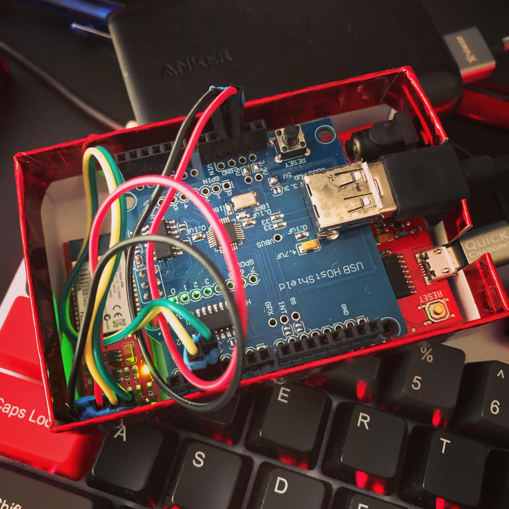

# RN42-HID-Relay
This is the Arduino (Uno) code for connecting RN42 Bluetooth module as a keyboard adapter (HID relay). It helps making any wired keyboard to connect Windows, MacOS and linux wirelessly.

## Parts
- [Arduino Uno](https://www.sparkfun.com/products/15123)
- [USB Host Shield (custom soldering required)](https://www.amazon.ca/Hidream%C2%AEUSB-Shield-Google-Android-Duemilanove/dp/B074HX4F1F/ref=sr_1_6?dchild=1&keywords=usb+host+shield&qid=1600885689&sr=8-6)
- [RN42 bluetooth module](https://www.sparkfun.com/products/12577)
- Power bank
- Jumper cables
- USB cables
## Credits
- [ibNai](https://github.com/ibNai/)
- [Jim Lindblom](https://learn.sparkfun.com/tutorials/using-the-bluesmirf/example-code-using-command-mode)
- [felis/USB_Host_Shield_2.0](https://github.com/felis/USB_Host_Shield_2.0)

